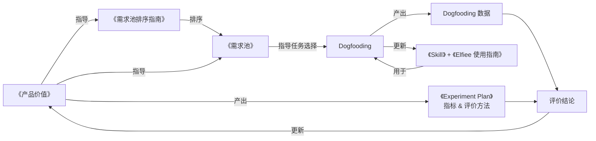

```mermaid
flowchart LR

%% ========= 核心节点 =========
PV["《产品价值》"]
NG["《需求池》"]
DP["Dogfooding"]
DD["Dogfooding 数据"]
EP["《Experiment Plan》<br/>指标 & 评价方法"]
EC["评价结论"]
RS["《需求池排序指南》"]
SK["《Skill》 + 《Elfiee 使用指南》"]

%% ========= 左侧：需求形成 =========
PV -- 指导 --> RS
RS -- 排序 --> NG
PV -- 指导 --> NG

%% ========= 主流程 =========
NG -- 指导任务选择 --> DP
DP -- 产出 --> DD
DD --> EC

PV -- 产出 --> EP
EP --> EC

%% ========= 内循环（红色语义） =========
EC -- 更新 --> PV

%% ========= 外循环（蓝色语义） =========
DP -- 更新 --> SK
SK -- 用于 --> DP
```
